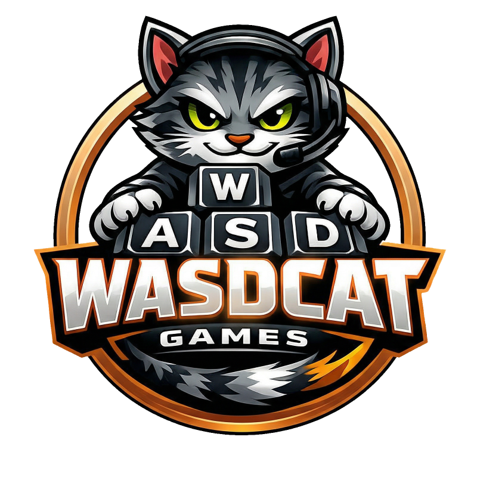

## About

WASDCAT Games is an independent indie game studio and label run by **Frank Winter** ([@fwdotcom](https://github.com/fwdotcom)). I build my own game projects and back other cool ideas through the label.

## 🤓 For the Tech Nerds

Big fan of open source – the main pieces of my setup:

- 🐧 [Arch Linux](https://archlinux.org/)
- 💻 [VS Code](https://code.visualstudio.com/)
- 🎮 [Godot Engine](https://godotengine.org/)
- 🎨 [Blender](https://www.blender.org/)

## 🎮 What's Going On Here

- 🛠️ Building indie games from scratch
- 🏷️ Releasing and supporting game projects through the label
- 🎨 Messing around with new ideas, mechanics, and genres

📬 Got questions or feedback? Just drop them right here in this repo.

---

### ⚖️ Legal Note

WASDCAT Games is **not a registered business** and does **not engage in commercial distribution**. Everything published here is a private, non-commercial project.

